# ЛАБОРАТОРНАЯ РАБОТА ПО ОБЩЕЙ ПРОГЕ

# ЧАСТЬ I. СРАВНЕНИЕ ХЭШ-ФУНКЦИЙ

## Положения
-   Процессор **Intel Core Ultra 7 155H**.
-   При размере таблицы $\approx 4000$ ячеек $\langle \text{load factor}\rangle = 15.9$,
    при размере таблицы $\approx 400$ - $\langle \text{load factor}\rangle = 158$.

## Измерение коллизий

### Константная функция
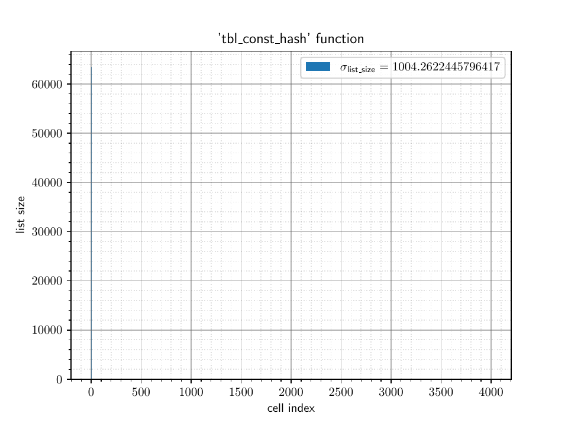

### ASCII первой буквы 
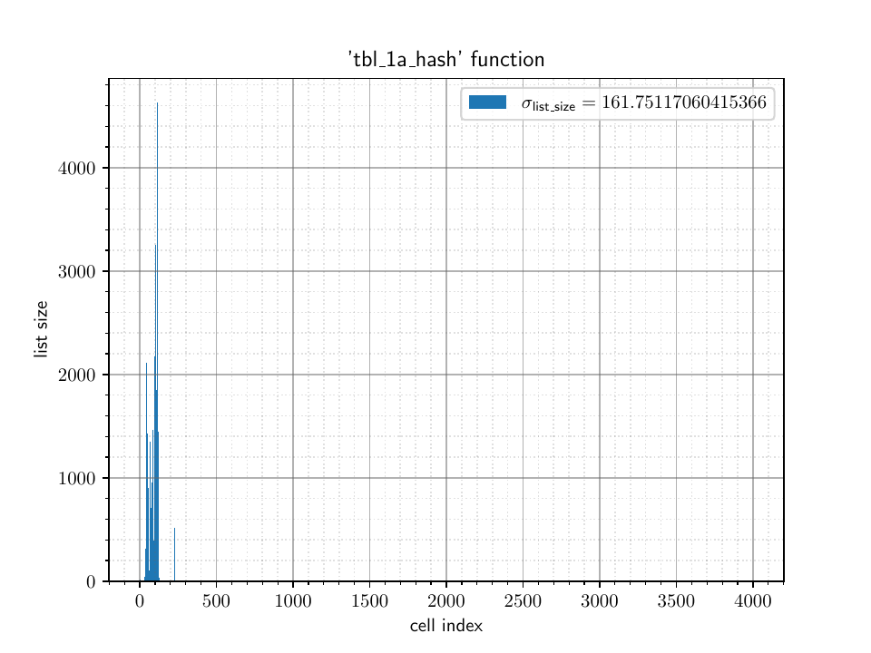

### Длина слова
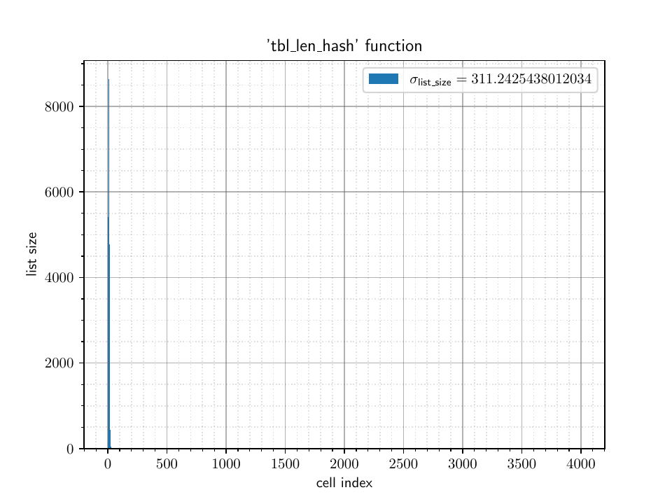

### Контрольная сумма
Размер таблицы $\approx 400$
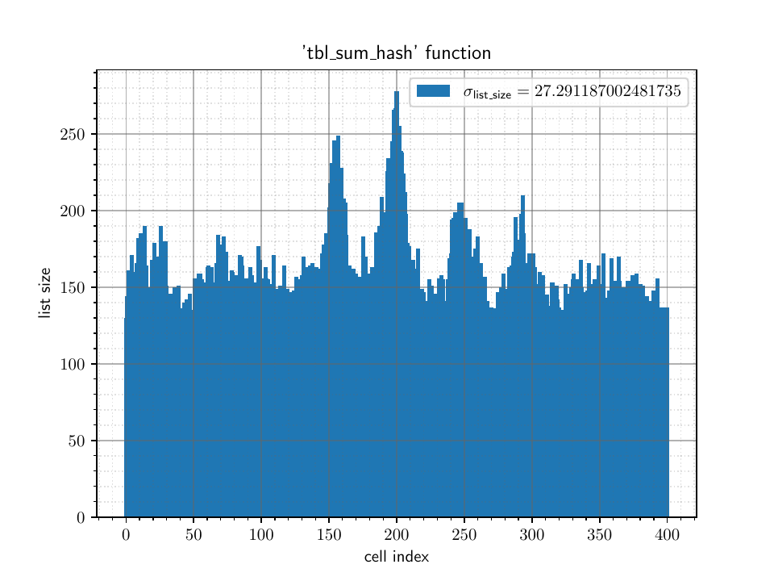

Размер таблицы $\approx 4000$
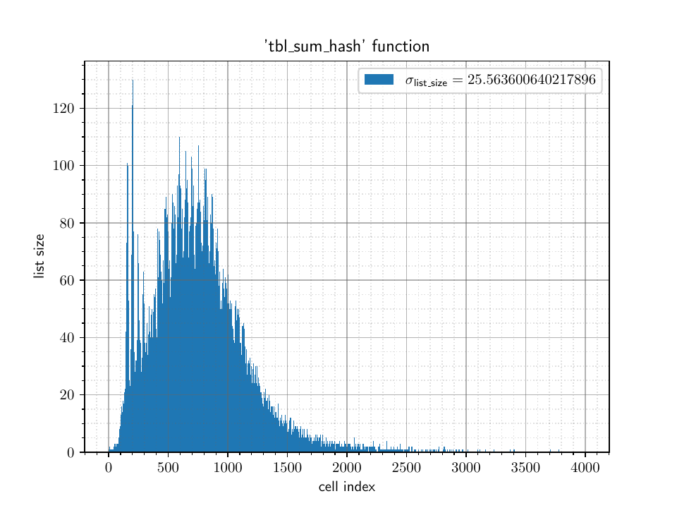

### ROL-XOR
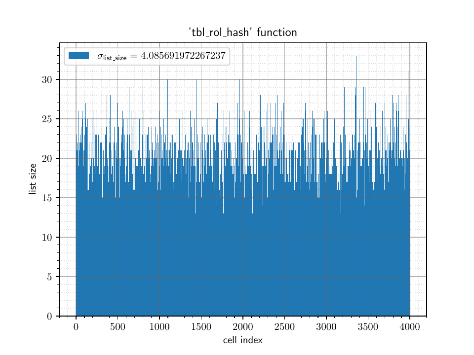

### CRC32
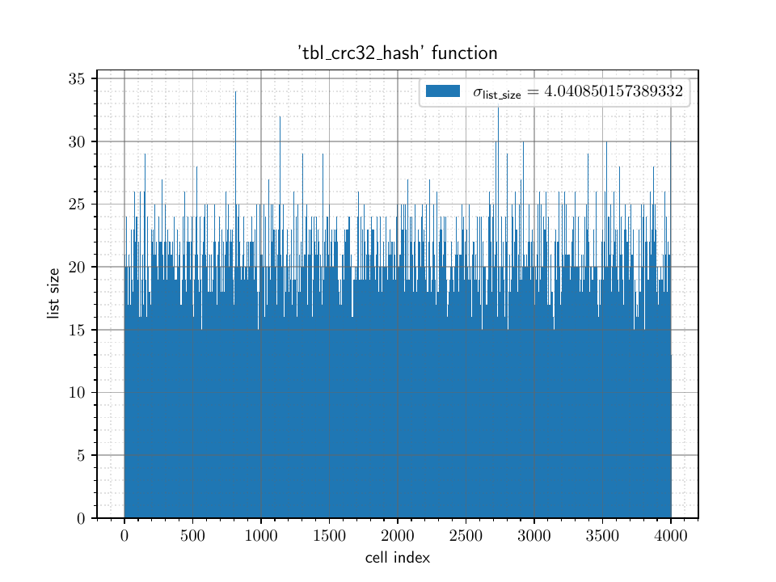

## Выводы
## Общая картина
Как и ожидалось, за счёт огромного количества коллизий, 
"вне конкуренции" по времени работы оказались *константная,
равная коду первого символа, равная длине строке хэш-функции*.
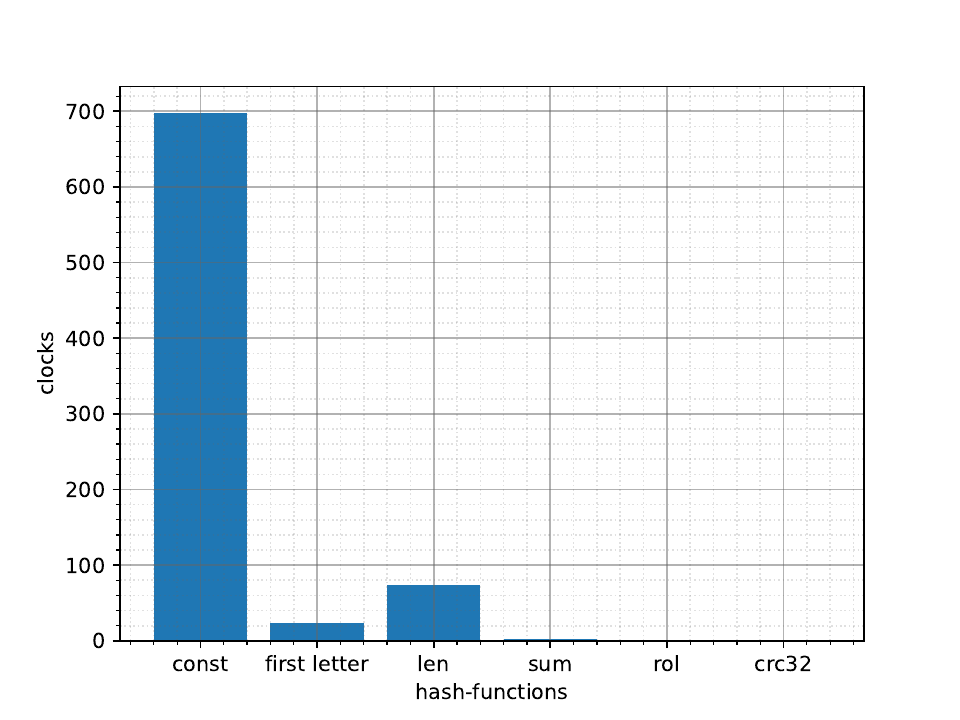

## Детали
Рассмотрим полсдение три хэш-функции боле подробно.
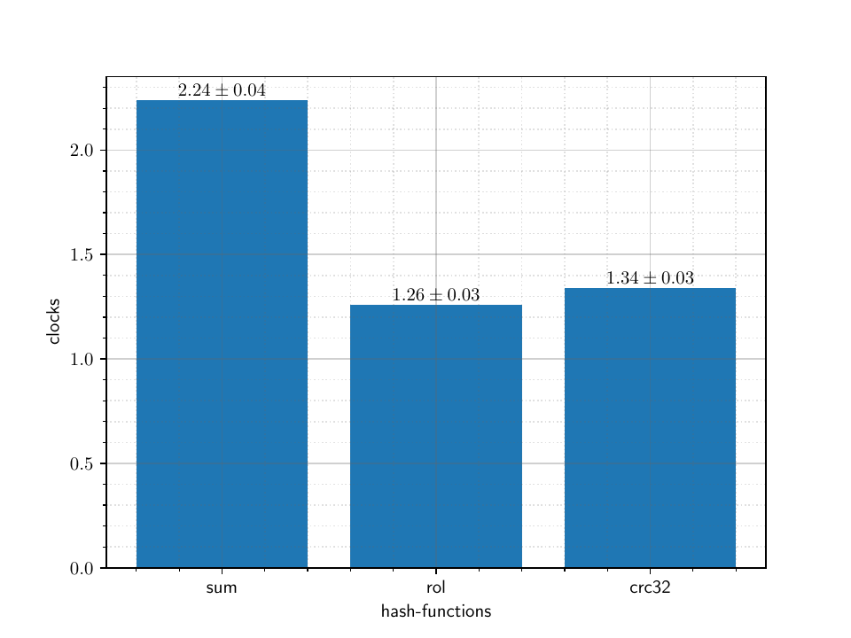

Как видно у контрольной суммы, уже на размерах порядка
$10^3$ *становится заметным пик*, отвечающий
среднему значению суммы ascii-кодов символов строки.
Понятно, что с ростом размеров таблицы, такая особенность
контрольной суммы будет приводить к всё более большим коллизиям.

Наилучшим образом показали себя функции `rol_hash` и `crc32_hash`.

# ЧАСТЬ II. ОПТИМИЗАЦИЯ ХЭШ-ТАБЛИЦЫ

## Положения
-   Результаты измерения продолжительности работы программы
    записаны в тактах $\cdot10^{-8}$
-   Время работы измерялось 
    по счётчику тактов процессора через инструкцию
    (интринсик) `rdtsc`
-   Программа запускалась на изолированном ядре
    через утилиту `taskset`
-   При профилировании программ использовался профилировщик `gprof`
-   Выбрана хэш-функция `crc32`, с рассчётом
    на возможность её дальнейшей оптимизации.

## Что имеем
Профилируем программу

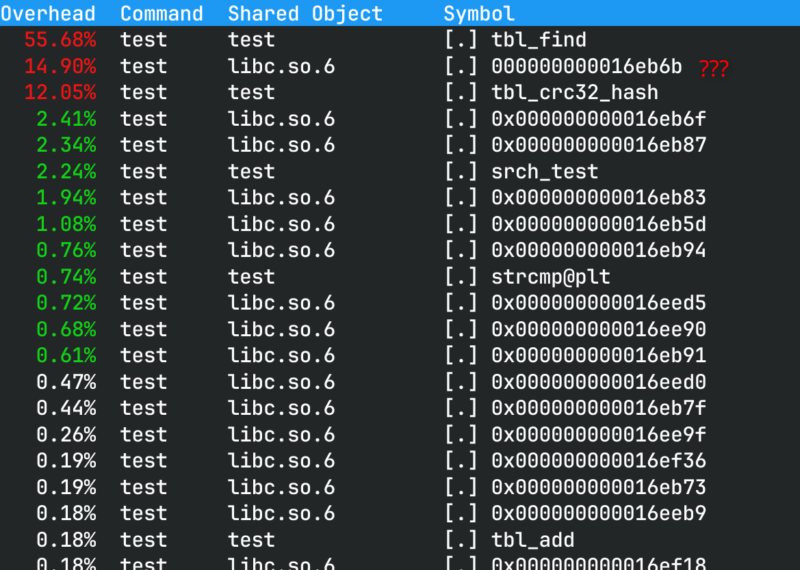
Неудивительно, что самой "горячей" оказалась функция `tbl_find`.
#### Результаты измерений тактов
|               | `strcmp`     | asm-вставка |
|    :---:      |    :---:     |   :---:     |
| $t_\text{ср}$ |     1.27     |  1.24       |
| $\sigma_{t}$  |     0.03     |   0.03      |

Обратим внимание на следущую за ней неизвестную библиотечную функцию.
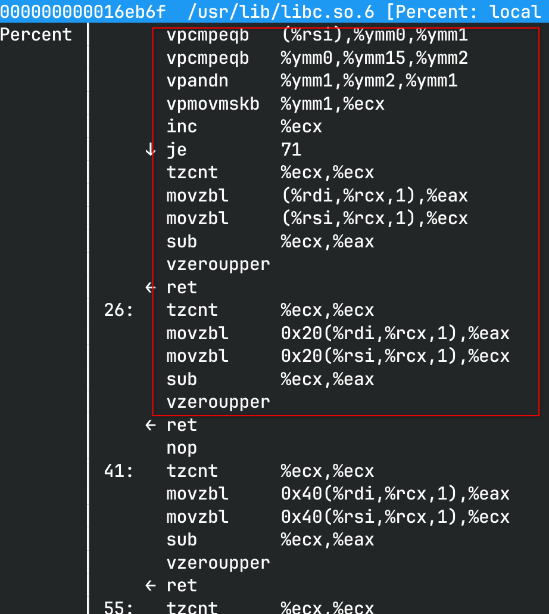

При трассировке программы через **gdb** оказалось, что эта функция - 
векторная рализация библиотеной `strcmp`.
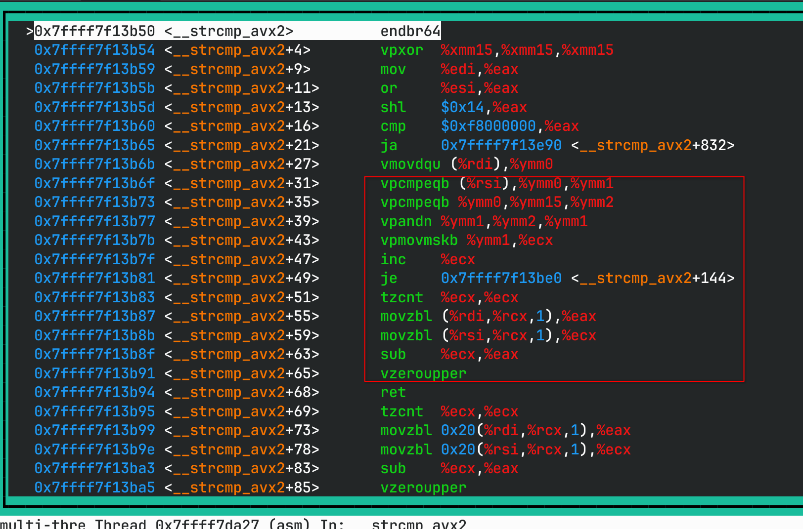

Таким образом, `strcmp` занимает $14.90$% процессорного времени.

## `key_cmp` - оптимизированная `strcmp`
Воспользуемся тем, что в данной реализации хэш-таблицы длина ключей
ограничена 64 символами. Соответственно, имеется возможность переписать
`strcmp` в более простой вид.

Сделаем это несколькими способами:
-   Перепишем всю функцию на ассемблер 
    ```gas
    key_cmp:
        vlddqu	(%rdi), %ymm0		# %ymm0 = low1
        vlddqu	(%rsi), %ymm1		# %ymm1 = low2
        vpsubb	%ymm1, %ymm0, %ymm0	# %ymm0 = cmp(low1, low2)
        vptest	%ymm0, %ymm0
        jnz	exit

        vlddqu	32(%rdi), %ymm0		# %ymm0 = hi1
        vlddqu	32(%rsi), %ymm1		# %ymm0 = hi2
        vpsubb	%ymm1, %ymm0, %ymm0	# %ymm0 = cmp(hi1, hi2)
        vptest	%ymm0, %ymm0

    exit:
        setnz	%al
        movzbq	%al, %rax
        ret
    ```
-   Используем ассемблерную вставку 
    ```c
	// %rdi - 1
	// %rsi - 2
	// retval - 0
	asm volatile(
		"vlddqu	(%1), %%ymm0		\n"
		"vlddqu	(%2), %%ymm1		\n"
		"vpsubb	%%ymm1, %%ymm0, %%ymm0	\n"
		"vptest	%%ymm0, %%ymm0		\n"
		"jnz	exit%=			\n"

		"vlddqu	32(%1), %%ymm0		\n"
		"vlddqu	32(%2), %%ymm1		\n"
		"vpsubb	%%ymm1, %%ymm0, %%ymm0	\n"
		"vptest	%%ymm0, %%ymm0		\n"

	"exit%=:				\n"
		"setnz	%0			\n"
		: "=r" (retval)				// output
		: "r" (key1), "r" (key2)		// input
		: "%ymm0", "%ymm1");			// destr list

	return retval;
    ```
-   Используем интринсики 
    ```c
    __m256i low1 = _mm256_lddqu_si256((const __m256i *)key1);
    __m256i low2 = _mm256_lddqu_si256((const __m256i *)key2);
    __m256i cmp = _mm256_sub_epi8(low1, low2);
    if(!_mm256_testz_si256(cmp, cmp))	return 1;

    __m256i hi1 = _mm256_lddqu_si256((const __m256i *)((uint64_t)key1 + 32));
    __m256i hi2 = _mm256_lddqu_si256((const __m256i *)((uint64_t)key2 + 32));
    cmp = _mm256_sub_epi8(hi1, hi2);
    return !_mm256_testz_si256(cmp, cmp);
    ```

Сравним листинги дизассемблера для интринсиков и написанной "вручную" функций:


#### Результаты измерений тактов
|               | `strcmp`     |полностью asm|  asm-вставка| интринсики    |
|    :---:      |    :---:     |    :---:    |    :---:    |    :---:      |  
| $t_\text{ср}$ |     1.27     |    1.15     |    1.08     |    1.09       |  
| $\sigma_{t}$  |     0.03     |    0.04     |    0.03     |    0.03       |  

**Вывод**: в пределах погрешностей можно говорить о том, что
производительность всех функций совпадает.
Одновременно с этим получен ответ на вопрос об ускорении программы
при встраивании функций в код: функция с ассемблерной вставкой
и функция с интринсиком были встроены компилятором в код:

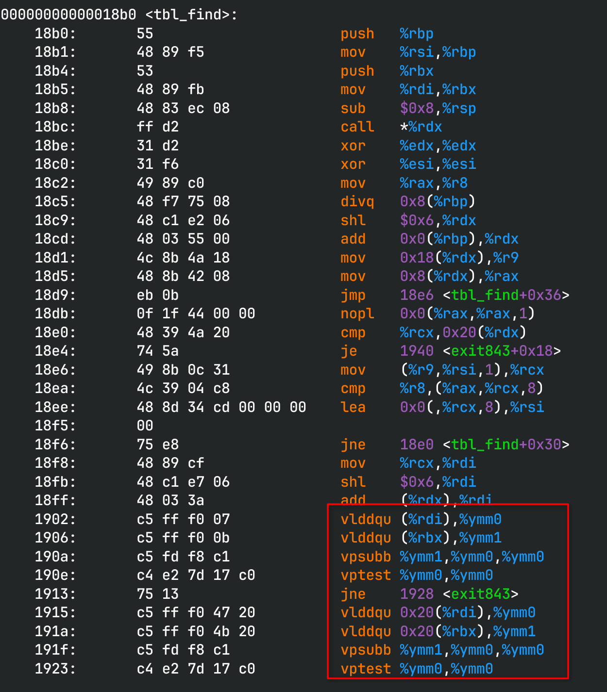
а функция, написанная на ассмеблере полностью - нет.
Таким образом, встраивание функций не играет большой роли в данном
случае.

**Итог**: ускорение на $(17\pm4)$%.

Далее будем использовать только реализацию `key_cmp`, использующую интринсики.

## Пробуем другие версии `crc32`
Перепрофилировав программу получаем следующий результат:

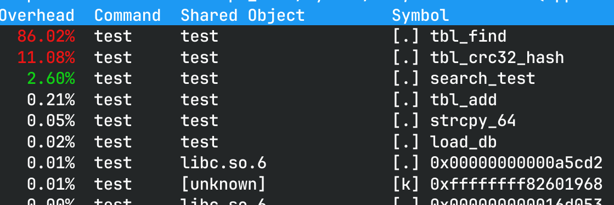

Самое время обратить внимание на хэш-функцию. К счастью,
для вычисления `crc32` существует отдельная машинная инструкция.
Использовать её можно через интринсик или ассемблерную вставку.

У аппаратной `crc32 %src, %dst` есть несколько форм команд:
-   `crc32  %r8, %r32`
-   `crc32  %r16, %r32`
-   `crc32  %r32, %r32`
-   `crc32  %r64, %r64` (старшие биты %dst[32-63] обнуляются)

Испытаем все версии с разверткой цикла и без:
-   Базовая функция
    ```c
	uint32_t hash = 0xFFFFFFFF;

	while(*key)
		hash = CRC32_TBL[(hash ^ *key++) & 0xff] ^ (hash >> 8);

	return ~hash;
    ```
-   Интринсик 64-bit
    ```c
	uint64_t hash = 0xFFFFFFFF;

	do
	{
		hash = _mm_crc32_u64(hash, *(uint64_t *)key);
		key += 8;
	}
	while(*(key-1));

	return ~hash;
    ```
-   Остальные функции реализованы аналогично

#### Результаты измерений тактов
|               | базовая     |8bit         | 8bit unroll  | 16bit        |  16bit unroll| 32bit        |32bit unroll  | 64bit        |64bit unroll  |
|    :---:      |   :---:     |    :---:    |     :---:    |  :---:       |:---:         |       :---:  |   :---:      | :---:        |      :---:   |
|  $t_\text{ср}$|   1.09      |     1.04    |   0.96       |    0.94      |   0.92       |   0.90       |    0.84      |    0.76      |    0.90      |
| $\sigma_{t}$  |   0.03      |     0.03    |    0.01      |       0.02   |      0.01    |      0.02    |     0.04     |    0.02      |   0.02       |

**Выводы**:
Достигнут пик производительности в 64-битной версии **без**
развертки цикла.

**Итог**: ускорение на $(43\pm5)$%.

В качестве последней оптимизации, заинлайним эту хэш-функцию:

|               | по указателю |инлайн       |
|    :---:      |    :---:     |    :---:    |
| $t_\text{ср}$ |     0.76     |    0.74     |
| $\sigma_{t}$  |     0.03     |    0.01     |

Опять же, в пределах погрешностей, разницы в производительности 
замечено не было.

## РЕЗУЛЬТАТЫ
Удачными решениями стоит признать
-   Использование аппаратной реализации `crc32` на 64 бита
    без развёртки цикла
-   Ускорение `strcmp` векторными инструкциями для частного случая
    (максимальная длина строки = 64 символа)

В результате этого **удалось увеличить производительность на $(75\pm5)$%**.

# ЧАСТЬ III\*. СРАВНЕНИЕ ПРОИЗВОДИТЕЛЬНОСТИ РАЗНЫХ ЯДЕР ПРОЦЕССОРА
*\* Примечание: данный пункт является необязательным и выполняется по усмотрению
преподавателя*

Для минимизации влияния посторонних процессов на тест, выполним загрузку,
указав загрузчику `linux` флаг `init=/bin/bash`.

***Прекрасный LINUX с одним процессом...***
[linux](images/linux.png)

Поочередно протестируем одну программу на нескольких ядрах CPU.
В результате у нас получилось распределение производительности
ядер процессора:

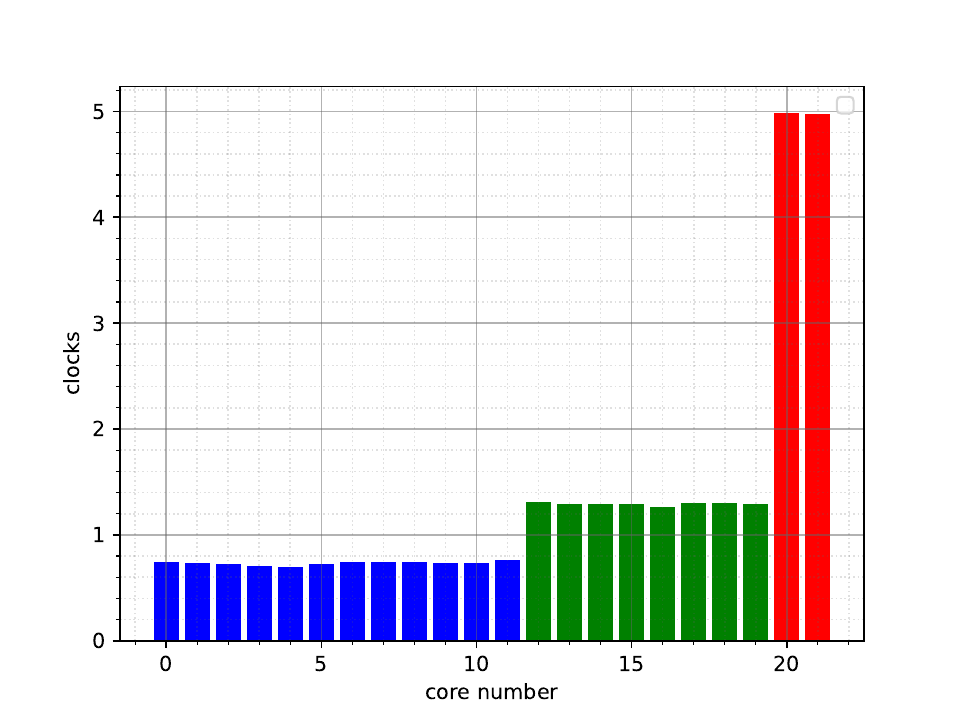

